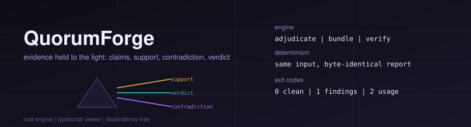

<!-- QuorumForge — a multi-agent evidence adjudication engine. -->

  

# ✦ QuorumForge ✦

### *Hold the evidence to the light. Watch the verdict refract.*

**QuorumForge** takes the recorded deliberation of a council of agents — who
supported what, who pushed back, how sure they were, and what they cited — and
passes it through a prism of weighted reasoning. Out the far side come four
clean bands of light: **consensus**, **split**, **contested**, and
**unsupported**. Deterministic. Auditable. Re-derivable by hand.

---

## The one-paragraph pitch

A council argues. Somebody has to write down what the argument *concluded*.
QuorumForge is that scribe — and, more importantly, that *judge*. It is **not an
agent orchestrator**: it does not run agents, call models, or manage prompts. It
operates purely on the *record* of a deliberation after the debate is over. That
separation is the whole point. Because the engine only reads a static transcript
of positions, its judgements are reproducible: the same evidence file always
yields the same verdict, the same report bytes, and the same integrity digest.
You can commit a verdict to version control and diff it next week.

---

## Why a prism?

